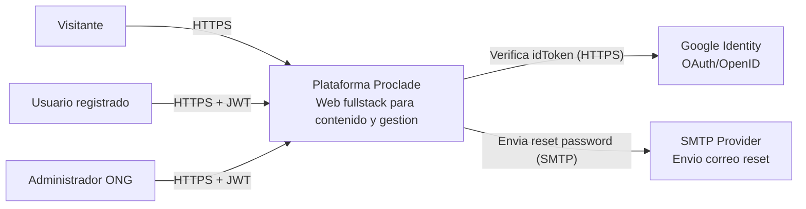

# 02.1 - C4 Context

## Objetivo

Mostrar actores y sistemas externos que interactuan con la plataforma.

## Notas

- El sistema se expone en web publica y panel admin dentro del mismo frontend.
- El backend concentra reglas de negocio y seguridad.
- Integraciones externas actuales: Google Identity y SMTP.
