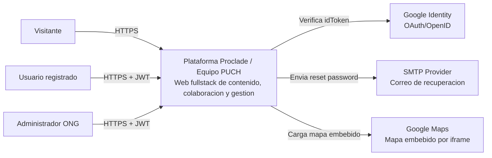

# 02.1 - C4 Context

## Objetivo

Mostrar actores y sistemas externos que interactuan con la plataforma.

## Notas

- El panel admin comparte frontend con la parte publica, pero con rutas y permisos separados.
- La seguridad real de acceso se aplica en backend, no solo en navegacion frontend.
- El chatbot forma parte del producto publico y tiene backoffice admin para gobernanza.
