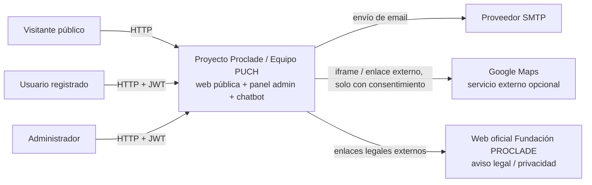

# 02.1 - C4 Context

## Objetivo

Mostrar qué actores y sistemas externos interactúan hoy con la plataforma real.

## Notas

- La autenticación actual es únicamente email/contraseña.
- El acceso admin comparte frontend con la web pública, pero el backend aplica guards específicos.
- Google Maps no se carga por defecto: depende de las preferencias de cookies/servicios externos del usuario.
- El chatbot forma parte del producto público y tiene una capa de administración separada.
