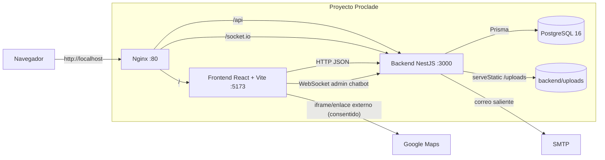

# 02.2 - C4 Container

## Objetivo

Describir los contenedores y procesos principales que forman el sistema en local.

## Estado actual

- Redis no existe en la topología actual.
- `frontend` y `backend` se ejecutan en modo desarrollo dentro de contenedor, pero el backend usa `yarn start`, no watch, para evitar procesos huérfanos.
- Nginx es el punto de entrada único esperado para pruebas funcionales.
