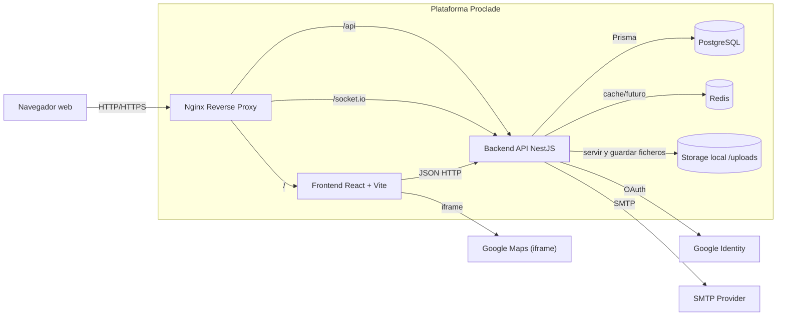

# 02.2 - C4 Container

## Objetivo

Describir contenedores tecnicos principales y sus relaciones.

## Notas

- En local se ejecuta sobre `docker compose`.
- Nginx es el punto de entrada unico y aplica cabeceras de seguridad.
- `/uploads` se sirve desde backend y se usa para imagenes/PDFs administrables.
