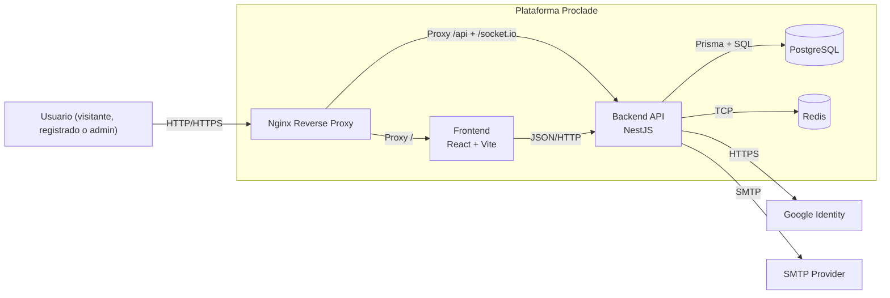

# 02.2 - C4 Container

## Objetivo

Describir los contenedores tecnicos principales y sus relaciones.

## Notas

- En desarrollo se ejecuta todo por Docker Compose.
- Nginx expone `localhost:80` y enruta a `frontend:5173` y `backend:3000`.
- Redis esta desplegado y disponible, aunque el uso funcional actual es limitado.
