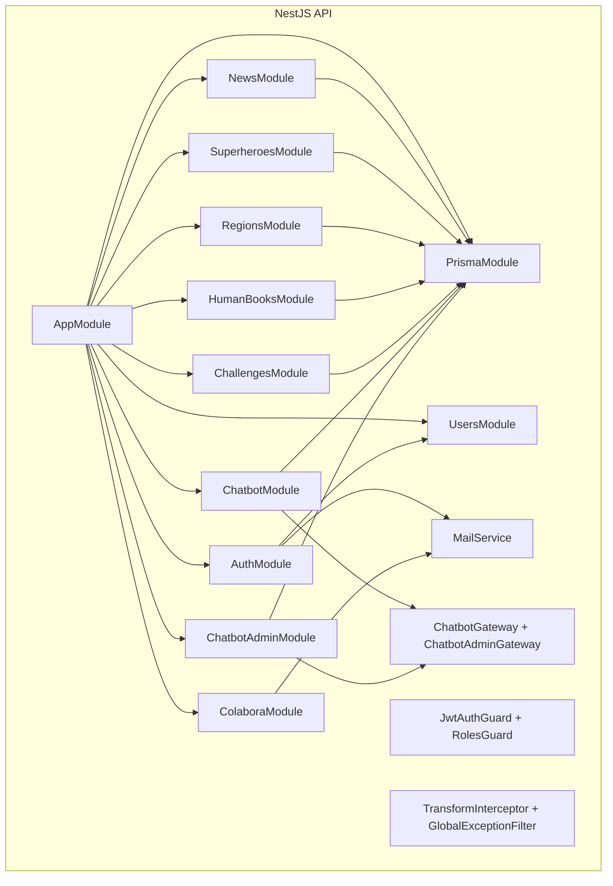

# 02.3 - C4 Component (backend)

## Objetivo

Resumir los módulos y componentes backend que sostienen el producto.

## Responsabilidades clave

- `AuthModule`
  - login
  - registro
  - forgot/reset password
  - cambio de contraseña autenticado
- `UsersModule`
  - CRUD admin
  - perfil
  - rol por defecto `USER`
  - conversión a real hero
- `NewsModule`, `SuperheroesModule`, `HumanBooksModule`
  - CRUD admin
  - publicación pública
  - limpieza de ficheros locales al borrar donde aplica
- `RegionsModule`
  - delegaciones públicas y admin
  - soporte de teléfono editable
- `ChallengesModule`
  - retos públicos activos
  - CRUD admin
- `ColaboraModule`
  - validación de formulario
  - control de aceptación de privacidad
  - envío SMTP
- `ChatbotModule`
  - sesiones
  - matching
  - contexto dinámico
  - feedback
  - unresolved
- `ChatbotAdminModule`
  - métricas
  - unresolved
  - knowledge base
  - intents/phrases
  - configuración runtime
  - difusión en tiempo real al panel admin
