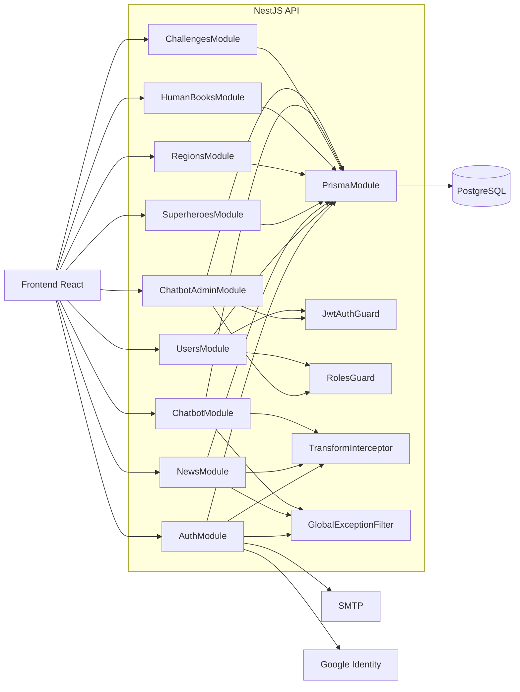

# 02.3 - C4 Component (Backend)

## Objetivo

Documentar los componentes principales del contenedor backend NestJS.

## Nota

`TransformInterceptor` y `GlobalExceptionFilter` garantizan el contrato `{ success, message, data }` en todo el backend.
