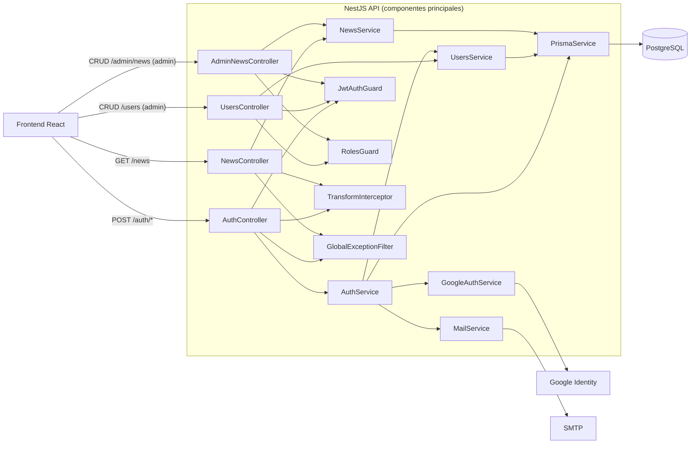

# 02.3 - C4 Component (Backend)

## Objetivo

Documentar componentes internos del contenedor backend (NestJS).

## Nota

Componentes compartidos (interceptor/filtro/guards) aplican transversalmente al backend.
