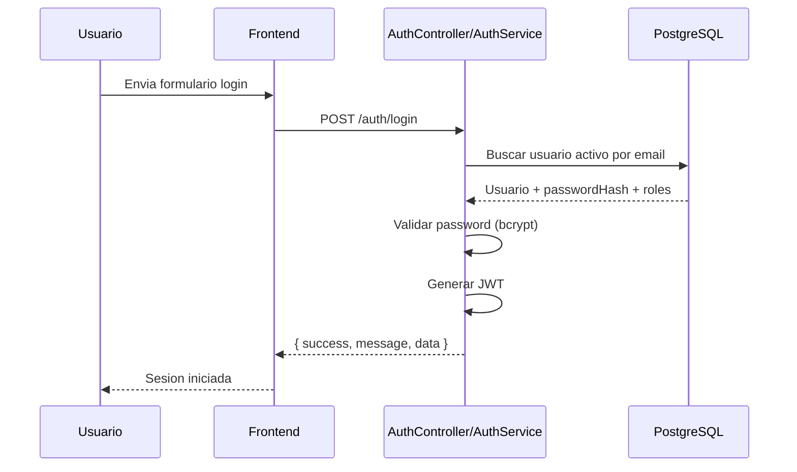
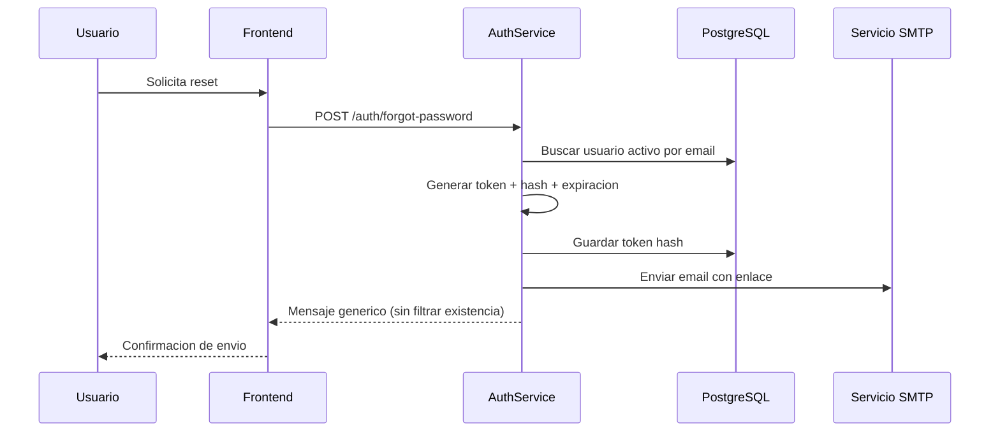
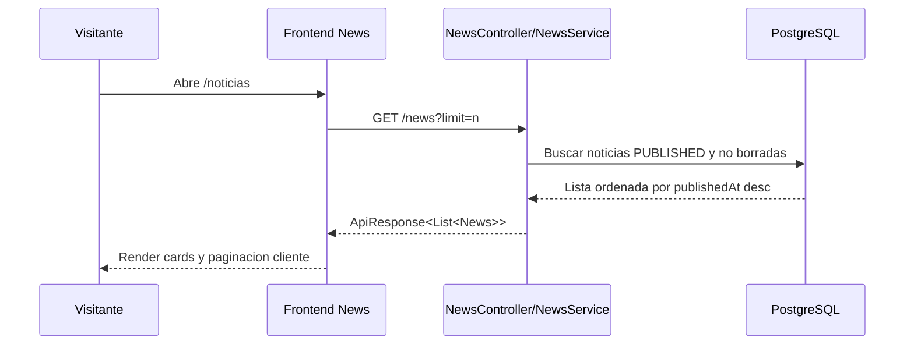
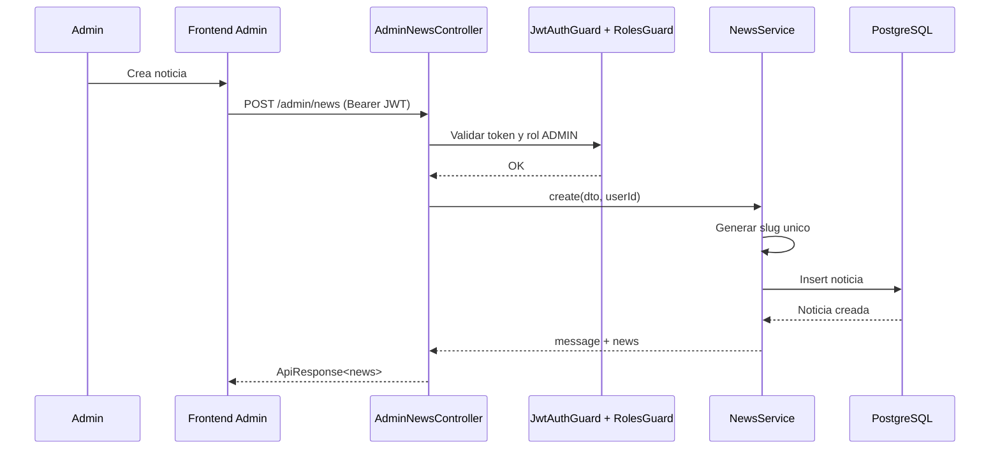

# 02.4 - Flujos Runtime Clave

## Flujo A - Login con email/password

```mermaid
sequenceDiagram
  participant U as Usuario
  participant FE as Frontend
  participant API as AuthController/AuthService
  participant DB as PostgreSQL

  U->>FE: Envia formulario login
  FE->>API: POST /auth/login
  API->>DB: Buscar usuario activo por email
  DB-->>API: Usuario + passwordHash + roles
  API->>API: Validar password (bcrypt)
  API->>API: Generar JWT
  API-->>FE: { success, message, data }
  FE-->>U: Sesion iniciada
```

## Flujo B - Recuperacion de contrasena

```mermaid
sequenceDiagram
  participant U as Usuario
  participant FE as Frontend
  participant API as AuthService
  participant DB as PostgreSQL
  participant SMTP as Servicio SMTP

  U->>FE: Solicita reset
  FE->>API: POST /auth/forgot-password
  API->>DB: Buscar usuario activo por email
  API->>API: Generar token + hash + expiracion
  API->>DB: Guardar token hash
  API->>SMTP: Enviar email con enlace
  API-->>FE: Mensaje generico (sin filtrar existencia)
  FE-->>U: Confirmacion de envio
```

## Flujo C - Listado de noticias publicas

```mermaid
sequenceDiagram
  participant V as Visitante
  participant FE as Frontend News
  participant API as NewsController/NewsService
  participant DB as PostgreSQL

  V->>FE: Abre /noticias
  FE->>API: GET /news?limit=n
  API->>DB: Buscar noticias PUBLISHED y no borradas
  DB-->>API: Lista ordenada por publishedAt desc
  API-->>FE: ApiResponse<List<News>>
  FE-->>V: Render cards y paginacion cliente
```

## Flujo D - Alta de noticia por admin

```mermaid
sequenceDiagram
  participant A as Admin
  participant FE as Frontend Admin
  participant API as AdminNewsController
  participant AUTH as JwtAuthGuard + RolesGuard
  participant SVC as NewsService
  participant DB as PostgreSQL

  A->>FE: Crea noticia
  FE->>API: POST /admin/news (Bearer JWT)
  API->>AUTH: Validar token y rol ADMIN
  AUTH-->>API: OK
  API->>SVC: create(dto, userId)
  SVC->>SVC: Generar slug unico
  SVC->>DB: Insert noticia
  DB-->>SVC: Noticia creada
  SVC-->>API: message + news
  API-->>FE: ApiResponse<news>
```
