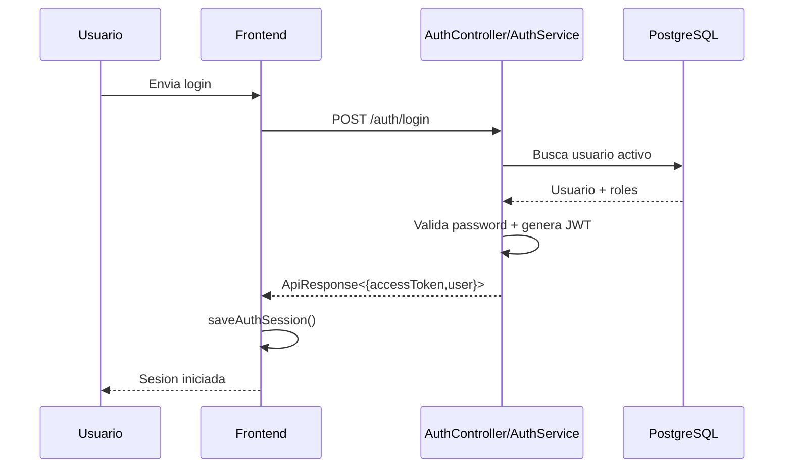
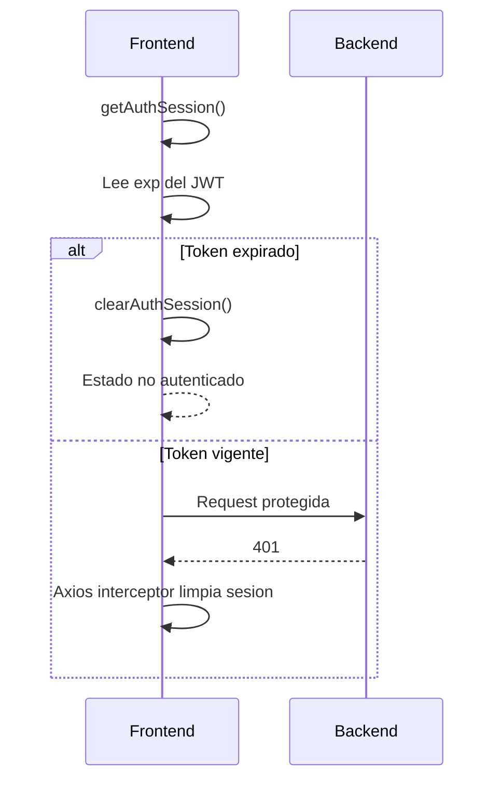
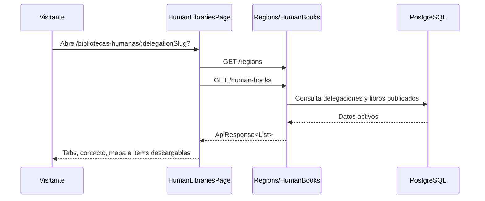
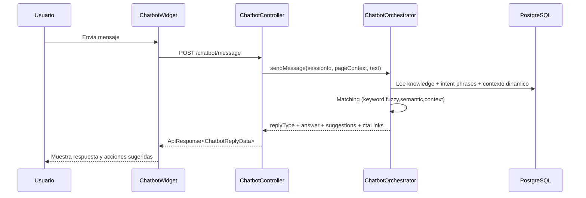
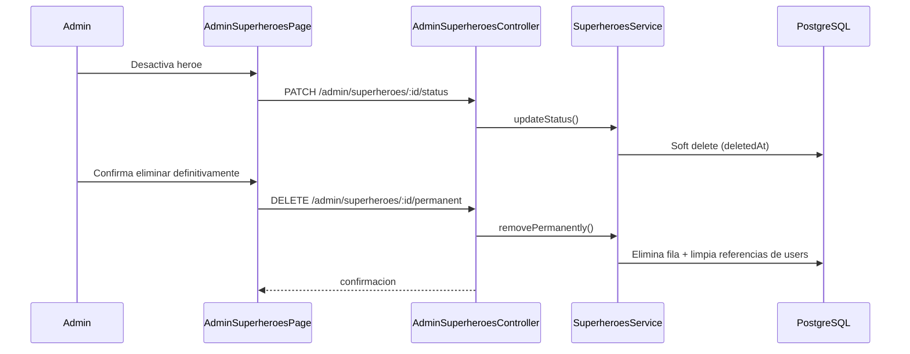

# 02.4 - Flujos Runtime Clave

## Flujo A - Login + sesion valida

## Flujo B - Token expirado en frontend

## Flujo C - Bibliotecas Humanas publicas

## Flujo D - Chatbot publico con contexto dinamico

## Flujo E - Gestion admin de superheroes (borrado definitivo)

