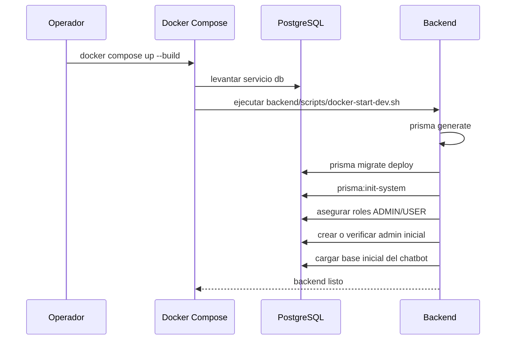
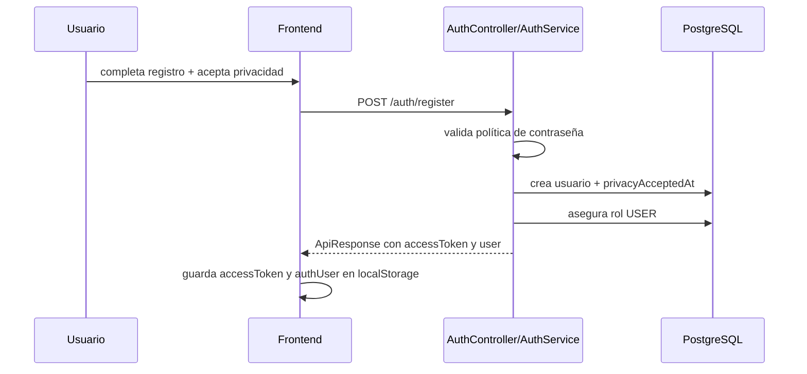
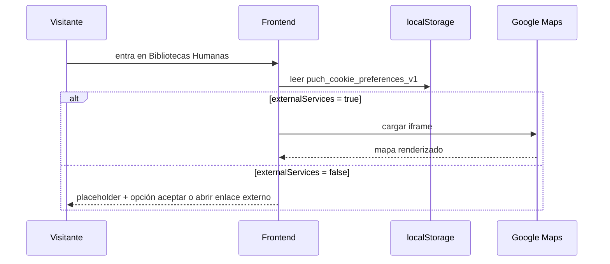
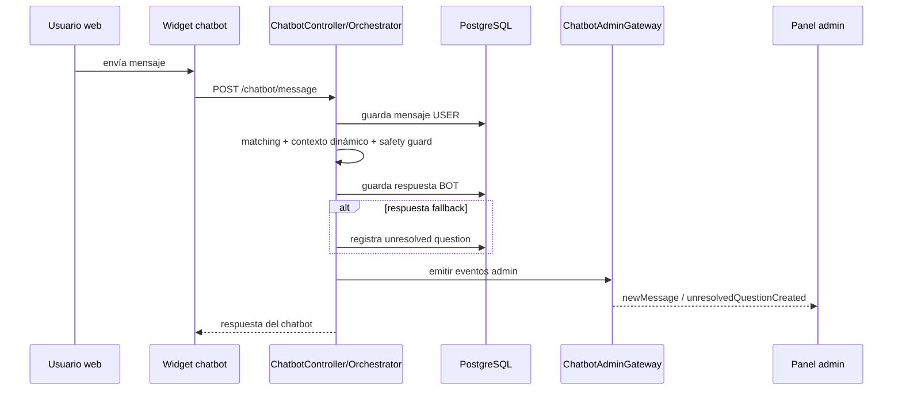

# 02.4 - Flujos runtime clave

## Flujo A - Arranque limpio del proyecto en Docker

## Flujo B - Registro con privacidad y sesión

## Flujo C - Mapa de delegación condicionado por cookies

## Flujo D - Chatbot público + actualización en tiempo real del panel admin

